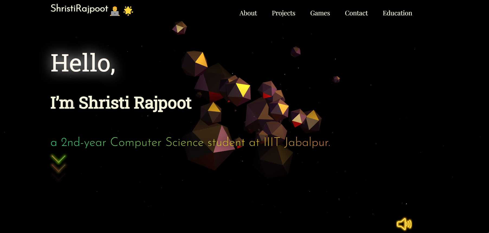

# 3D Portfolio Website

A cutting-edge 3D portfolio website. This project features 3D animations, audio integration, and dynamic content, providing an immersive user experience.

---

## 🛠️ Features

- **3D Animations**: Engaging 3D visuals to captivate users.
- **Responsive Design**: Optimized for all devices, from desktops to mobiles.
- **Audio Integration**: Enhances user interaction with sound effects.
- **Custom Icons and Images**: Personalized branding with custom assets.
- **Manifest Integration**: Supports PWA (Progressive Web App) functionalities.

---

## 🚀 Getting Started

### Prerequisites

To run this project locally, ensure you have the following installed:

- [Node.js](https://nodejs.org/) (for dependency management)
- A modern browser (Chrome, Edge, or Firefox recommended)

### Installation

1. **Clone the repository**:
   ```bash
   git clone https://github.com/Shristirajpoot/3d-portfolio.git
   ```
2. **Navigate to the project directory**:
   ```bash
   cd 3d-portfolio
   ```
3. **Install dependencies**:
   ```bash
   npm install
   ```

### Run Locally

1. Open the `index.html` file in your browser.
2. For a local server, use a tool like Live Server (VS Code extension) or run:
   ```bash
   npx http-server
   ```
3. Access the project at `http://localhost:8080`.

---

## 📁 Project Structure

```
3d-portfolio/
├── audios/               # Audio files for sound effects
├── icons/                # Custom icons for branding
├── images/               # Images and visual assets
├── js/                   # JavaScript files
├── css/                  # Stylesheets
├── index.html            # Main HTML file
├── manifest.webmanifest  # Manifest file for PWA support
├── package.json          # Project metadata and dependencies
├── package-lock.json     # Detailed dependency tree
└── .gitignore            # Ignored files in version control
```

## 🖼️ Screenshots

Add screenshots or GIFs to showcase the project:




---

## 🔗 Live Demo
 

---


---

## 🤝 Contributing

Contributions are welcome! Follow these steps:

1. Fork the repository.
2. Create a new branch:
   ```bash
   git checkout -b feature-branch-name
   ```
3. Commit your changes:
   ```bash
   git commit -m "Add your message here"
   ```
4. Push to your fork:
   ```bash
   git push origin feature-branch-name
   ```
5. Create a Pull Request.

---

## 🛡️ License

This project is licensed under the MIT License - see the [LICENSE](LICENSE) file for details.

---

## 👩‍💻 Author

- **Your Name**  
  [GitHub](https://github.com/Shristirajpoot) • [LinkedIn](https://linkedin.com/in/shristi-rajpoot-36774b281/)

---

## 📜 Acknowledgments

- Icons from [Flaticon](https://www.flaticon.com/)
- Animations inspired by [Three.js](https://threejs.org/)
- Audio effects sourced from [Freesound](https://freesound.org/)
